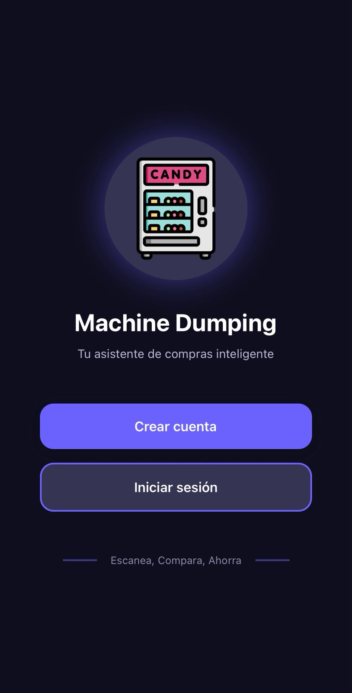
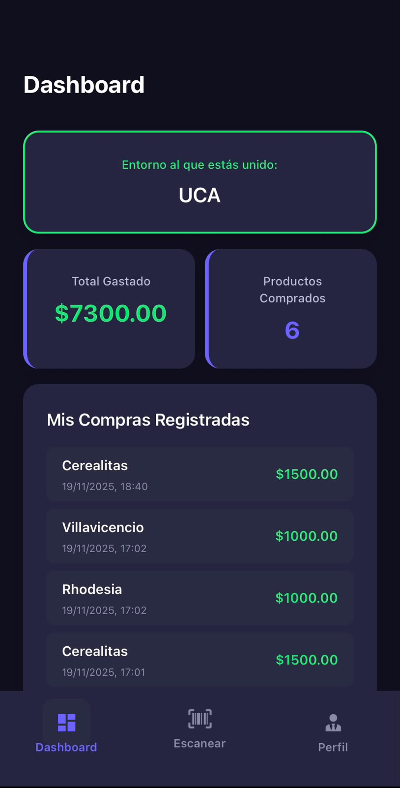
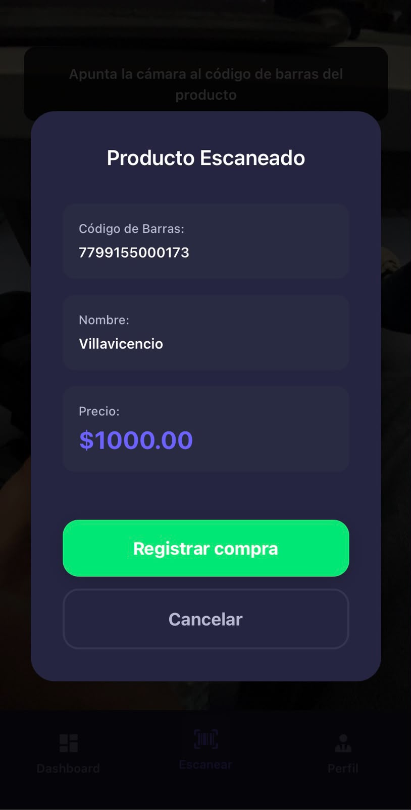
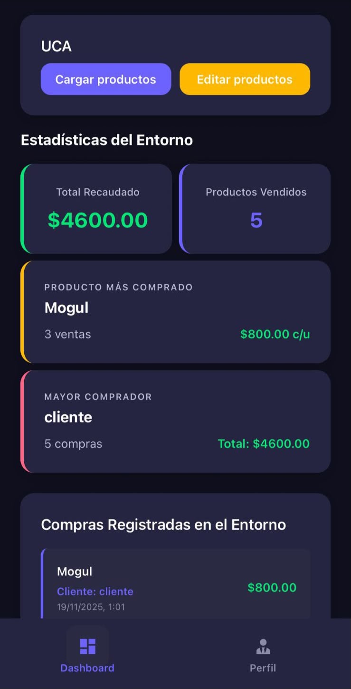

# Machine Dumping App

## 📱 Vista previa

<table>
  <tr>
    <td align="center" width="25%">
      <br/>
      <sub><b>Pantalla de inicio</b><br/>Login y registro de usuarios (clientes o empresas)</sub>
    </td>
    <td align="center" width="25%">
      <br/>
      <sub><b>Dashboard del cliente</b><br/>Entorno al que está unido, total gastado y compras registradas</sub>
    </td>
    <td align="center" width="25%">
      <br/>
      <sub><b>Escaneo de productos</b><br/>Confirmación de compra tras escanear el código de barras</sub>
    </td>
    <td align="center" width="25%">
      <br/>
      <sub><b>Dashboard de la empresa</b><br/>Carga y edición de productos, recaudación, producto más vendido y mayor comprador</sub>
    </td>
  </tr>
</table>

Aplicación full-stack con backend Node.js + Express + Prisma y frontend React Native + Expo que muestra un ranking de usuarios por dinero gastado.

## Requisitos

- **Node.js** v18 o v20 (recomendado)
- **npm** o **yarn**
- **Git**
- **Expo Go** app en tu móvil (opcional, para probar en dispositivo físico)

## Instalación y Ejecución

### Clonar el repositorio

```bash
git clone https://github.com/NicolasBroyad/machine-dumping-backend.git
cd machine-dumping-backend
```

### Backend (Terminal 1)

```bash
# Ir a la carpeta del backend
cd machine-dumping-backend

# Instalar dependencias
npm install

# Generar Prisma Client
npx prisma generate

# Aplicar migraciones (crea la base de datos SQLite)
npx prisma migrate dev --name init

# Poblar la base de datos con datos de ejemplo
npm run seed

# Iniciar el servidor
npm start
```

 El backend estará corriendo en **http://localhost:3000**

Verifica que funciona:
```bash
curl http://localhost:3000/ranking
```

### Frontend (Terminal 2 - nueva terminal)

```bash
# Ir a la carpeta del frontend
cd machine-dumping-frontend

# Instalar dependencias
npm install

# Iniciar Expo
npm start
```

Luego:
- Presiona **`a`** para Android emulator
- Presiona **`i`** para iOS simulator
- Escanea el QR con Expo Go desde tu móvil

## Configuración del proyecto

1. Instala las dependencias: `npm install`
2. Edita `app.json` y cambia la IP en `extra.apiUrl` por tu IP local
3. Para obtener tu IP:
   - Windows: abre CMD y ejecuta `ipconfig`
   - Mac/Linux: abre Terminal y ejecuta `ifconfig`
   - Busca la IPv4 de tu adaptador WiFi
4. Ejecuta el proyecto: `npx expo start`

**Nota:** Asegúrate de que tu dispositivo y la computadora estén en la misma red WiFi.

## Configuración según tu dispositivo

### Android Emulator
 Ya configurado. Usa `http://10.0.2.2:3000` automáticamente.

### iOS Simulator
 Ya configurado. Usa `http://localhost:3000` automáticamente.

### Dispositivo físico (Expo Go)
1. Obtén tu IP local:
   ```bash
   # Linux/Mac
   hostname -I | awk '{print $1}'
   
   # Windows
   ipconfig
   ```

2. Edita `machine-dumping-frontend/app/ranking.tsx` línea ~17:
   ```typescript
   const BASE_URL = 'http://TU_IP_AQUI:3000';
   ```
   Ejemplo: `const BASE_URL = 'http://192.168.1.42:3000';`

## Estructura del proyecto

```
machine-dumping-app/
├── machine-dumping-backend/     # Backend (Node.js + Express + Prisma)
│   ├── index.js                 # Servidor principal
│   ├── prisma/
│   │   ├── schema.prisma        # Esquema de base de datos
│   │   ├── seed.js              # Datos de ejemplo
│   │   └── dev.db               # Base de datos SQLite
│   └── package.json
│
└── machine-dumping-frontend/    # Frontend (React Native + Expo)
    ├── app/
    │   ├── _layout.tsx          # Layout con tabs
    │   ├── index.tsx            # Pantalla de escaneo
    │   ├── ranking.tsx          # Pantalla de ranking
    │   └── perfil.tsx           # Pantalla de perfil
    └── package.json
```

## Endpoints del Backend

- **GET** `/ranking` - Devuelve usuarios ordenados por dinero gastado
- **POST** `/usuarios` - Crea un nuevo usuario
  ```json
  { "nombre": "Juan", "email": "juan@example.com" }
  ```
- **POST** `/productos` - Crea un nuevo producto
  ```json
  { "codigoBarra": "123", "nombre": "Producto X", "precio": 50 }
  ```
- **POST** `/escaneos` - Registra un escaneo
  ```json
  { "usuarioId": 1, "productoId": 1 }
  ```

## 🔧 Comandos útiles

### Backend
```bash
# Ver/editar base de datos con interfaz visual
npx prisma studio

# Regenerar cliente de Prisma (si cambias schema.prisma)
npx prisma generate

# Resetear base de datos y volver a poblarla
npx prisma migrate reset
npm run seed

# Ver logs del servidor
npm start
```

### Frontend
```bash
# Limpiar caché de Expo
npx expo start -c

# Instalar dependencias de iOS (solo Mac)
cd ios && pod install && cd ..
```

## Solución de problemas

### Error: "Cannot find module '.prisma/client'"
```bash
cd machine-dumping-backend
npx prisma generate
```

### Error: "Network Error" en la app
- Verifica que el backend esté corriendo (`npm start` en backend)
- Verifica la URL según tu entorno (ver sección "Configuración según tu dispositivo")
- Verifica que el puerto 3000 no esté bloqueado por firewall

### Error: "Database ... does not exist"
```bash
cd machine-dumping-backend
npx prisma migrate dev --name init
```

### La tabla aparece vacía
```bash
cd machine-dumping-backend
npm run seed
```

## 🛠️ Tecnologías utilizadas

**Backend:**
- Node.js
- Express
- Prisma ORM
- SQLite

**Frontend:**
- React Native
- Expo
- TypeScript
- Expo Router

## 📝 Notas

- El backend usa SQLite, no necesita configuración adicional de base de datos
- Los datos de ejemplo incluyen 10 usuarios con diferentes gastos
- El ranking se actualiza automáticamente al abrir la pantalla
- CORS está habilitado para desarrollo

## 👤 Autor

Nicolás Broyad, Tomas Espionosa, Mateo de la Fuente
